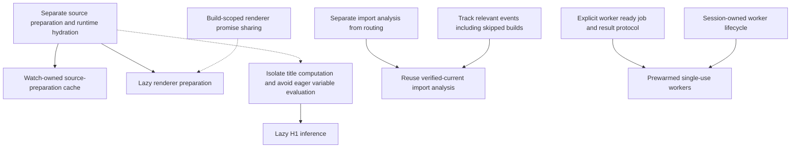

# Plan: reduce repeated watch-build preparation

Status: phase 1, the Markdown source-preparation split/cache from phases 2–3, phase 4 fingerprints, and phase 5 dependency-analysis reuse remain implemented on `perf/334-markdown-preparation`.
Phase 6 experiments are evaluated: layout-chain reuse is deferred, and speculative worker prewarming was rejected by the user and removed.
Selective lazy default-renderer preparation and conditional Handlebars loading are now implemented and measured; HTML source caching and lazy H1/variable evaluation remain optional follow-ups.
See [phase 1 results](334-markdown-results.md), [source-cache results](334-markdown-cache-results.md), [Oro local-link validation](334-oro-validation.md), [fingerprint results](334-fingerprint-results.md), and [dependency-analysis results](334-dependency-analysis-results.md) for scope, validation, measurements, and limitations.
Phase 6A is measured and deferred: the [layout-stage report](334-layout-results.md) finds only 0.369 ms of concrete chain traversal versus a 52.065 ms layout-loading stage that chain reuse would not remove.
The [phase 6B report](334-prewarmed-worker-results.md) is retained as historical evidence for the removed experiment, not as a claim about the current runtime.
Oro validation is complete, including dependency-matched timing, output equivalence, work counters, and serialized payload-size observations.
The [cache resource follow-up](334-cache-resource-results.md) now records actual-payload clone/dispatch timing, controlled live heaps, and process-wide peak RSS with attribution limits.
The [duplicate-build investigation](334-duplicate-build-investigation.md) now reproduces a delayed truncate/write-notification mechanism on both beta.8 and the candidate and tests write stabilization without changing production defaults.
Decision: defer source-write stabilization and layout-chain reuse; do not ship speculative worker prewarming.
Workers start on demand as before; no idle replacement is prepared.
Chokidar's internal 50 ms throttle and our `atomic: 300` setting are already active, but `awaitWriteFinish` is not enabled.
The experimental 50 ms stability window prevented the controlled duplicate on both implementations, but adds delay and changes event timing; no new watcher option or production behavior change is planned in this pass.
Natural duplicate frequency remains timing-dependent, and the investigation does not establish the delay behind every earlier sample.
The [lazy-preparation report](334-lazy-preparation-results.md) records a 24-page metadata/template-only benchmark improvement from approximately 108–110 ms to 50–53 ms, but no convincing end-to-end Oro improvement.
Custom Markdown settings remain eager; source snapshots and synchronous metadata remain available before rendering.
Related issue: [#334 — Watch profiling: single Markdown edits still initialize all pages and parse every document for H1 titles](https://github.com/bcomnes/domstack/issues/334).
Related correctness work: [#328 — static re-export dependency tracking](https://github.com/bcomnes/domstack/issues/328).

## Checkpoint commits

Create a focused checkpoint commit on `perf/334-markdown-preparation` after each completed, validated work unit before moving to the next substantial change.
Keep dependent runtime integration together, and include its tests and benchmark tooling.
Keep Oro's local validation tools and private/ignored benchmark evidence out of these commits; do not commit Oro without separate approval.
Do not push or rewrite existing checkpoints unless requested.

Completed implementation checkpoints:

| Commit | Scope |
| --- | --- |
| `70fc49e` | Markdown title/renderer optimizations and watch-owned source-preparation cache, with tests and benchmark |
| `6d24d34` | Duplicate-event characterization and genuine in-flight edit preservation tests |
| `20a419c` | Primitive and structured fingerprint fast paths, compatibility tests, and benchmark |
| `e30f3a8` | Observed dependency-analysis reuse, event/lifecycle integration, 30 added tests/subtests, and measurement report |

Documentation checkpoint `160195f` records the earlier plan, measurement reports, and deferred stabilization decision.
Reports describing uncommitted work or no commits refer to their earlier measurement sessions, before these checkpoints were created.
Documentation checkpoint `c445346` records phase 6A's measurements and the decision not to ship chain caching for a sub-millisecond observed traversal cost.
Checkpoint `abe3e48` implemented and measured phase 6B, but the user subsequently rejected speculative worker preparation.
Removal checkpoint `2e73cad` reverses its runtime, protocol, and test changes while retaining the measurements and decision history.
The checkpoint accompanying the [lazy-preparation report](334-lazy-preparation-results.md) adds conditional default-renderer/Handlebars loading, regression tests, and a fresh-worker benchmark.
Further optional HTML source-cache or metadata-laziness extensions should start with new measurements.

## Goal

Reduce edit-to-settled latency by avoiding unnecessary source preparation, serialization, dependency analysis, and worker startup work.
Combine caching, which avoids repeating work for unchanged inputs, with selective laziness, which avoids work that a build never consumes.
Keep existing page APIs, fresh application-module execution, watch invalidation, and successful-build state commit semantics intact.

This is an internal optimization effort, not a new application invalidation API.
Applications must not need to adopt stateful global data, provide hashes, or declare another set of changed keys to benefit.

## Evidence and baseline

The issue reports the following steady-state averages for nine single-build edits on the Oro website using DOMStack 12.0.0-beta.8.
These are instrumented local wall-clock measurements, not expected savings or portable performance guarantees.

| Phase | Reported time |
| --- | ---: |
| Initialize 605 source pages | 221 ms |
| Markdown H1 extraction, included in initialization | 173 ms |
| Frontmatter processing, included in initialization | 15 ms |
| Fresh worker startup, input transfer, and framework loading | 108 ms |
| Global-data fingerprinting | 61 ms |
| Layout loading and resolution | 55 ms |
| Application global-data function and state snapshot | 43 ms |
| Selected page and aggregate outputs | 27 ms |
| Watch dependency-index rebuilding | 25 ms |
| Total edit-to-settled time | Approximately 568 ms |

Each measured rebuild read 585 Markdown files, initialized nine Markdown renderers, and called `renderInnerPage()` twice while rewriting one HTML page.
The first edit sometimes produced two events and two builds; investigate that separately rather than treating it as steady-state overhead or assuming a debounce cause.

A read-only local experiment compared the existing title extractor with a dedicated parser using `markdownit().disable('inline')`.
Results matched across 136 repository documents and additional edge cases combined.
Warmed corpus timings were 11.7–12.5 ms for the existing extractor and 4.9–5.4 ms with inline parsing disabled.
This is evidence for a candidate optimization, not an Oro rebuild result or an exhaustive equivalence proof.

## Design constraints

- Preserve synchronous access to `page.vars`, `page.pageInfo`, and other currently initialized metadata in global-data callbacks.
- Continue exposing every eligible source-backed page to global data, not only changed or output-selected pages.
- Preserve existing `dataDeps` declarations, validation, fingerprinting, and invalidation behavior.
- Distinguish source-input changes from output selection and executable-module freshness.
- Reuse existing watch input changes and reset reasons rather than inventing a competing invalidation system.
- Keep fresh application-module execution across builds unless a separately evaluated design explicitly changes that contract.
- Preserve the renderer's captured source when a file changes during an active build.
- Preserve `readMarkdownContent()` as an independent filesystem read, as required by existing tests.
- Preserve H1 inference semantics, including raw inline Markdown, fences, indentation, Setext headings, and heading order.
- Do not cache rendered output merely because the renderer or its source is unchanged.
- Do not advance accepted preparation or producer baselines after a failed build or failed output reconciliation.
- Do not let application mutation poison reusable cache entries.
- Preserve failure detection, warning behavior, and retry semantics unless a behavior change is separately approved.
- Keep generated-page definitions and executable values outside the source-preparation cache.

## Intended architecture

Separate initialization responsibilities without making the entire asynchronous `PageData.init()` operation an implicit getter side effect.
A synchronous metadata getter cannot transparently await file reads, imports, or async variable functions.

| Responsibility | Intended handling |
| --- | --- |
| Source identity and discovery information | Immediately available from current discovery |
| Markdown or HTML source preparation | Reuse private source records; refresh changed or missing entries |
| Companion exports, executable vars, layout selection, assets, and subscriptions | Resolve against current runtime inputs |
| H1 inference | Cache; investigate deferred extraction only where synchronous metadata behavior is preserved |
| Renderer construction | Separate from metadata; defer work where source snapshots and initialization behavior remain correct |
| Markdown renderer instance | Share one in-flight initialization per settings identity and build lifetime |
| Rendering and output hooks | Execute only when requested, with current render inputs |

Global-data delta construction currently needs only source identities and paths.
However, the producer may inspect every page, and the framework subsequently binds global data and registers subscriptions for every source page.
Laziness is useful only if these operations do not force the same expensive preparation immediately afterward.

## Phase 0: establish repeatable measurement

- [x] Measure initial-build and edit-to-settled latency against the unchanged published beta.8 baseline on Oro.
- [x] Preserve the same source fixture, runtime version, edit operation, output checks, and session structure for before/after comparisons.
- [x] Record initial readiness separately from steady-state edits.
- [x] Retain raw event logs and build counts and separate multi-build samples; no double builds occurred in the Oro validation runs.
- [ ] Measure phase durations and deterministic work counters without retaining ad hoc modifications to installed packages or application sources.
- [ ] Keep detailed behavioral tests beside their subsystems under `lib/` and checked-in acceptance example sites under `test-cases/`.

Record at least:

- Markdown source reads, frontmatter parses, title parses, and prepared-source cache hits/misses.
- Markdown renderer initialization count and actual render calls.
- HTML writes and correctness of raw Markdown, search JSON, and LLM outputs.
- Worker readiness, dispatch/input cloning, layout loading, result transfer, and parent acceptance.
- Cache payload size, retained memory, and candidate delta size.
- Fingerprint traversal time and dependency-analysis calls.

Do not use brittle wall-clock thresholds in ordinary correctness tests.
Use counters and output assertions there, and report timings in repeatable benchmarks.

## Phase 1: focused Markdown optimizations

Primary files:

- `lib/build-pages/page-builders/md/extract-title-from-md.js`
- `lib/build-pages/page-builders/md/extract-title-from-md.test.js`
- `lib/build-pages/page-builders/md/index.js`
- `lib/build-pages/page-builders/md/get-md.js`
- `lib/build-pages/page-builders/md/get-md.test.js`

### 1A. Avoid unnecessary title parsing work

- [x] Disable inline parsing in the dedicated title parser, subject to differential regression coverage.
- [x] Preserve block parsing rather than replacing heading detection with a regular expression.
- [x] Skip H1 inference when parsed frontmatter explicitly supplies an overriding title.
- [x] Preserve override behavior for empty strings, `null`, and other explicitly supplied values rather than testing truthiness.
- [x] Compare old and candidate extraction results across a representative corpus and focused edge cases.

Cover ATX and Setext headings, multiline headings, lists, blockquotes, fences, indented code, inline formatting, links and reference definitions, entities, escapes, line endings, empty headings, and documents without an H1.

### 1B. Deduplicate in-flight renderer initialization

- [x] Store the initialization promise before awaiting it.
- [x] Scope sharing to a build lifetime and settings identity, including direct-build paths that can run more than once in one process.
- [x] Capture the resolved renderer in each page closure instead of reading a mutable module-global renderer at render time.
- [x] Evict genuinely rejected initialization promises so retry remains possible.
- [x] Preserve the current settings-error fallback in `getMd()` rather than changing it as part of deduplication.
- [x] Test concurrent callers, distinct settings, rejection/retry, and isolation between builds.

Measure this change independently; nine initialization calls do not establish a particular time saving.

## Phase 2: separate source preparation from runtime initialization

Primary files:

- `lib/build-pages/page/page-data.js`
- `lib/build-pages/page-builders/md/index.js`
- `lib/build-pages/page-builders/html/index.js`
- `lib/build-pages/build.js`
- `lib/build-pages/page/page-data-renderer.test.js`
- `lib/watch/prepared-renderers.test.js`

- [x] Extract explicit source-preparation records and runtime hydration steps, initially for Markdown.
- [x] Keep full page metadata available before application code depends on it.
- [x] Reconstruct runtime closures, subscriptions, layout bindings, hooks, and assets using current build inputs.
- [x] Keep executable companion/global/layout vars outside the reusable source record.
- [x] Preserve captured-source rendering and independent raw-content reads.
- [ ] Extend the same boundary to HTML if it remains straightforward and useful.

### Selective laziness

- [x] Identify deferrable operations: unused default Markdown rendering dependencies and optional Handlebars loading, without deferring source metadata or application validation.
- [x] Implement lazy default-renderer preparation from captured source with build-scoped in-flight sharing and rejection eviction.
- [x] Preserve custom Markdown settings and caller-supplied resolver execution timing by keeping them eager.
- [ ] Investigate lazy H1 extraction when page variables are never consumed.
- [ ] Account for `PageData.init()` currently merging variables and for later subscription registration; a title getter alone is insufficient if either forces evaluation.
- [ ] Preserve final variable precedence, enumeration, freezing, and first-access behavior if title evaluation becomes lazy.
- [x] Demonstrate genuinely skipped work in fresh-process module tests and a template-only benchmark that consumes every title; retain the synchronous metadata API.

The [selective-laziness results](334-lazy-preparation-results.md) distinguish a substantial no-render benchmark benefit from effectively flat Oro watch medians.
Oro's custom settings still initialize once per build, so it does not exercise default-renderer deferral.
First-use default initialization errors now occur at rendering, and applications relying on Handlebars' incidental require hooks must import Handlebars explicitly.
Source preparation remains eager on cold/reset builds to preserve the public contract.
The main expected watch improvement comes from combining this separation with reusable source records, not from promising fully lazy pages.

## Phase 3: retain cloneable source preparation across watch builds

Integration points:

- `lib/watch/index.js`
- `lib/build-pages/worker/protocol.js`
- `lib/build-pages/worker/index.js`
- `lib/build-pages/index.js`
- `lib/build-pages/build.js`

### Cache ownership and schema

- [x] Add a private, watch-session-owned accepted preparation baseline independent of producer state and output-write caches.
- [x] Retain at most the current accepted entry per source rather than an unbounded history of edits.
- [x] Define a narrow Markdown-only transport schema containing source identity, captured body, and source-derived vars including parsed frontmatter and title.
- [ ] If lazy title extraction is introduced, distinguish an uncomputed title from a computed `null` result; current titles remain eager on cache misses.
- [x] Fall back to ordinary preparation for entries that cannot safely preserve their values across transport.
- [x] Exclude functions, live `PageData`, renderer instances, subscriptions, output records, and generated definitions.
- [x] Keep accepted/candidate records isolated from mutable objects exposed to application code.

### Invalidation and membership

- [x] Use existing input changes and reset reasons, not `pageFilterPaths`, to determine source reuse.
- [x] Begin conservatively by bypassing the old baseline on reset reasons and uncertain recovery paths.
- [x] Refresh changed/new entries and reconcile deletions, renames, builder-type changes, and eligibility against current discovery.
- [x] Preserve the distinction between full output selection and source-input reset.
- [x] Keep invalidations arriving during an active build queued for the following batch.
- [x] Make the optimization available to sites without `global.data` or retained producer state.

### Transport and commit

- [x] Pass accepted entries through the worker's explicit option allowlist.
- [x] Return candidate upserts/removals through an internal report field, since the parent reconstructs top-level worker results.
- [x] Distinguish no candidate, an empty delta, and replacement with an empty baseline.
- [x] Avoid transporting a baseline that a reset will discard.
- [x] Validate transport safety before output writes so serialization failures do not lose write-accounting information.
- [x] Commit only after the complete page phase, output cleanup, and dependency refresh succeed.
- [x] Discard candidates on failures and clear accepted state on session disposal.
- [x] Return only changed entries and removals rather than unchanged source bodies.
- [x] Measure representative large-site serialized proxy payload sizes: Oro's incoming baseline is approximately 6.59 MiB and its single-edit return delta is approximately 8.12 KiB.
- [x] Profile actual-payload clone/dispatch timing, controlled retained heap, and observed peak memory, distinguishing worker sampling from process-wide RSS and startup/scheduling from pure cloning.

Do not copy the output ledger's partial-failure commit behavior; it tracks filesystem effects, whereas preparation caching tracks an accepted input baseline.
Avoid transferring and detaching the only accepted source buffers, because they are needed for rollback and future builds.

### Optional smaller staging step

Not pursued in the current implementation because full Markdown source preparation is now cached.
If profiling shows full prepared-source transport is too expensive, evaluate a compact content-keyed inferred-title cache.
This retains source reads and needs a trustworthy content key, but can remove unchanged-document title parsing with a smaller worker payload.
Choose this only if measurements justify it as a useful stage rather than maintaining two competing cache designs indefinitely.

## Phase 4: reduce fingerprint serialization overhead

Primary files:

- `lib/build-pages/global-data/watch-dependencies.js`
- `lib/build-pages/global-data/watch-dependencies.test.js`
- `lib/helpers/stable-json-stringify.js`

- [x] Add an exact fast path for supported primitive values using their existing JSON representation and SHA-256 format.
- [x] Measure the primitive change independently.
- [x] Implement and measure a guarded combined validation/canonicalization traversal for ordinary arrays and plain objects.
- [x] Preserve key ordering, escaping, cycle handling, array shape rules, unsupported-value behavior, and exact fingerprint bytes.
- [x] Retain the current path for exotic cases whose JSON behavior cannot safely be reproduced by the fast path, including raw JSON and altered-prototype boxed primitives.
- [x] Include inherited `toJSON()`, proxies, aliases, special property names, Unicode ordering, and numeric edge cases in differential tests.
- [x] Avoid changing the shared canonicalization helper's other consumers unintentionally.

The [phase 4 report](334-fingerprint-results.md) records exact-hash checks and an Oro median edit-to-settled improvement from 368.90 ms to 339.28 ms beyond the Markdown optimizations.
All 30 measured edits passed output assertions; the baseline's one multi-build warm-up remains recorded separately.

Do not infer unchanged output keys from producer state, source deltas, object identity, or shallow freezing.
Do not stop fingerprinting returned keys based solely on current subscriptions.
Opaque values must retain their conservative invalidation behavior.

## Phase 5: reuse import analysis while refreshing dependency routing

Primary files:

- `lib/watch/dependency-index.js`
- `lib/watch/dependency-index.test.js`
- `lib/watch/index.js`
- `lib/watch/plan.js`

- [x] Separate reusable import-analysis results from routing maps built from current discovery and successful layout reports.
- [x] Preserve existing per-rebuild entry deduplication rather than adding a redundant cache.
- [x] Retain verified-current successful analysis across eligible filtered rebuilds, including Markdown/HTML-only edits.
- [x] Track dirtiness for every delivered event, including browser-only or otherwise skipped page-build events.
- [x] Reanalyze affected roots and reported transitive closures, with conservative refresh for structural changes, uncertain history, and recovery.
- [x] Preserve fresh analysis by default for direct `rebuild(siteData)` callers that supply no event history.
- [x] Refresh routing even when import analysis is reused, because frontmatter and generated outputs can change layout membership.
- [x] Preserve current discovery-object identity, previous snapshot isolation, generated-owner replacement, empty-result replacement, and role-specific failure recovery.
- [x] Gate retention on actual watcher membership and canonical paths; cover ignored parents, atomic exclusions, external inputs, and symlinks.
- [x] Cover in-flight invalidation, working-directory changes, sticky watcher-error distrust, and stop/restart cleanup.
- [x] Consider shared transitive parse reuse after measurement: defer it because eligible warm Oro edits now avoid all 52 analyzer calls.

The [phase 5 report](334-dependency-analysis-results.md) records a 332.67 → 314.75 ms median across 15 edits per variant, with one candidate double-build sample retained in the statistics.
Separately profiled dependency-index time fell from 25.78 ms to 0.41 ms; initial analysis still runs and now verifies observation.
All measured outputs passed, and the full suite passed 750 tests with the same two existing TODOs.
Reuse is limited to the installed analyzer's supported graph; static re-exports and bare-import resolution remain unresolved under #328.

Do not share a visited set in a way that drops dependencies from later roots.
Do not rely on metadata such as file size and modification time as proof of exact content equivalence.
Do not allow reuse to hide missing static re-export tracking covered by #328.

## Phase 6: layout and worker experiments

### 6A. Build-local layout-chain reuse — measured and deferred

- [x] Separate outstanding layout-import waits, vars resolution, and chain traversal in three fresh Oro profiling sessions.
- [x] Evaluate retaining validated chains: defer implementation because 605 concrete traversals take only 0.369 ms median across nine post-warm-up edits.
- [x] Review ownership and mutation semantics: independent page arrays alone do not preserve later ancestry changes to shared mutable layout records.
- [x] Preserve existing fresh imports and all-layout validation by leaving runtime behavior unchanged.

The [layout-stage report](334-layout-results.md) records 52.065 ms median loading time, largely covered by outstanding import waits, and 0.110 ms layout-vars resolution.
Chain reuse would not eliminate that loading cost, and a cache must still allocate page-owned arrays and preserve generated-page/direct-call mutation behavior.
All twelve profiled edits, including warm-ups, passed output checks and produced a single build.
No runtime cache or uninstrumented latency improvement is claimed for this phase.

Revisit only if a workload with deeper chains or more generated pages demonstrates meaningful traversal cost.
Any future implementation must preserve fresh imports and validation of every discovered layout, independent page arrays, and current handling of within-build reparenting.
Do not load only output-selected or previously used layouts, since current metadata and generated factories can select different layouts.

### 6B. Prewarmed, single-use workers — rejected and removed

- [x] Prototype and measure explicit readiness, single-job execution, session ownership, and shutdown behavior.
- [x] Compare prior runtime, cold protocol, and prewarmed protocol with separate resource measurements.
- [x] Record the user's decision not to use speculative preparation and remove the implementation.

The experiment moved approximately 94.45 ms of worker preparation CPU ahead of an edit rather than eliminating it, retained an idle worker with approximately 19.27 MiB sampled V8 used heap, and prepared a final worker that might never be used.
Despite the measured idle-separated latency benefit, this approach is not desired and is no longer part of the runtime.
The [phase 6B report](334-prewarmed-worker-results.md) retains the measurements and validation of the removed prototype.
The additional protocol/error-handling changes and their tests were reverted with it, not retained as an unrequested independent refactor.
Do not resume prewarming or substitute persistent application workers without a new explicit decision.

Default-renderer and optional Handlebars laziness from phase 2 are implemented; remaining optional work is HTML source-preparation caching and lazy H1/variable evaluation, starting with measurements of genuinely avoidable work.

### Deferred: persistent application workers

Do not transparently reuse a worker that has already executed application code as part of this plan.
Unchanged modules can contain mutable state, and ESM cache-busting on an entry does not refresh its entire transitive graph.
A future persistent-worker design requires an explicit execution-state contract or genuine per-build application isolation.
Existing producer reset reasons are not sufficient executable-module invalidation signals.

## Regression and acceptance matrix

| Area | Required checks |
| --- | --- |
| Markdown semantics | Existing titles and HTML remain identical; explicit frontmatter title precedence is preserved |
| Incremental edits | Correct HTML, raw Markdown, search, and LLM outputs; sibling HTML remains untouched when not invalidated |
| Metadata API | Producers can synchronously inspect all pages, including non-stateful producers |
| Work avoidance | Unchanged eligible sources avoid repeated reads/parses on the cached path; renderer initialization is deduplicated; metadata-only builds without custom settings skip default renderer setup |
| Source snapshots | In-flight source edits do not alter the active renderer and are observed by the next batch |
| Shared inputs | Settings, layout, vars, helper, and mixed-role changes retain correct broad invalidation and reload behavior |
| Membership | Add, delete, rename, draft eligibility, and builder-type changes reconcile correctly |
| Generated pages | Factories, subscriptions, layout membership, and stale-output removal remain correct |
| Failure handling | Render, producer, template, generated-hook, cleanup, and analysis failures do not poison accepted state |
| Mutation isolation | Application mutation cannot alter retained source preparation or accepted producer state |
| Fingerprints | Candidate fingerprints and invalidation results match the existing implementation |
| Dependency reuse | Skipped events, changed imports, missing-file recovery, and empty dependency results remain correct |
| Lifecycle | Stop/restart, independent sessions, and active-build shutdown remain isolated; workers start on demand without speculative prewarming |
| Resource use | Cache size stays bounded by current sources; transfer and memory costs do not erase latency gains |

Run focused subsystem tests for each change, followed by relevant watch integration tests, lint, type checking, and broader tests as appropriate.
Normal development does not require declaration builds.
Do not claim Oro performance improvements without rerunning its end-to-end workload.

## Dependencies and parallel implementation

The phase numbers indicate recommended priority, not a single mandatory implementation chain.
Distinguish a hard implementation prerequisite from preferred sequencing, shared-file coordination, and a measurement gate.
The dependencies below describe the original implementation design, including the now-deferred layout cache and rejected prewarming experiment; they do not authorize restarting those workstreams.
A prerequisite can be implemented in the same PR as its consumer rather than requiring a separate release.

### Dependency matrix

| Change | Hard prerequisite within this design | Independent of | Coordination or qualification |
| --- | --- | --- | --- |
| Disable inline parsing for title extraction, phase 1A | None | Every other optimization | Confined mainly to the dedicated extractor and tests |
| Skip title inference for explicit frontmatter titles, phase 1A | None | Parser optimization, cache, and laziness | Shares the Markdown builder with renderer and preparation changes |
| Deduplicate renderer initialization, phase 1B | None | Title parsing, source cache, fingerprints, and dependency reuse | Requires build-scoped ownership; coordinate builder options and direct-build behavior |
| Separate source preparation from runtime hydration, phase 2 | None | Phase 1 optimizations, fingerprints, dependency reuse, and prewarming | Prefer landing small Markdown fixes first to reduce overlapping edits |
| Lazy renderer preparation, phase 2 | Separation of captured source/metadata from renderer preparation | Cross-build cache, title-parser optimization, fingerprints, and dependency reuse | Reuse phase 1B's promise-sharing helper if landed; otherwise provide safe concurrent initialization in this change |
| Lazy H1 inference, phase 2 | Isolate title computation and remove eager accesses that would force it | Cross-build cache and worker prewarming | Includes the variable-merge/access redesign; remains conditional on preserving synchronous metadata semantics |
| Watch-owned source-preparation cache, phase 3 | Stable preparation record and hydration boundary from phase 2 | Lazy renderer/title work, fingerprints, dependency reuse, and prewarming | Needs its own protocol, invalidation, and successful-commit integration; eager title computation can remain initially |
| Optional compact title cache, phase 3 | Content identity plus watch-owned transport/invalidation/commit support | Full preparation/hydration split and laziness | Alternative staging approach, not a prerequisite for the full source cache |
| Primitive fingerprint fast path, phase 4 | None | All source, renderer, dependency, and worker changes | Can ship as a small isolated PR |
| Structured-value fingerprint fast path, phase 4 | Exact-equivalence coverage and safe fast-path/fallback design | Primitive fast path and all other workstreams | Prefer primitive work first because both edit the same fingerprint implementation |
| Separate dependency analysis from routing, phase 5 | None | Source caching, fingerprints, laziness, and prewarming | Preserve fresh direct-call behavior and existing routing contracts |
| Reuse dependency analysis across builds, phase 5 | Analysis/routing separation plus complete dirty-event tracking | Source caching, fingerprints, and prewarming | Cache and dirty tracking must ship together; include events that skip page builds |
| Build-local layout-chain reuse, phase 6A | None | Source caching, laziness, fingerprints, dependency reuse, and prewarming | Shares `build.js` and `page-data.js` with source preparation work |
| Single-use worker prewarming, phase 6B, rejected | Ready/job/result protocol and session-owned worker lifecycle | Source cache, lazy pages, fingerprints, and dependency reuse | Historical dependencies only; prototype removed, do not resume without a new explicit decision |
| First-edit double-build investigation | Event/batch instrumentation | Every optimization | Separate diagnostic work, not a blocker for independently verified improvements |

Measurement infrastructure is a shared validation prerequisite for claiming performance improvements, not a code dependency that must block all implementation.
Capture the unchanged baseline before merging runtime optimizations and measure each change against an appropriate reference.

### Dependency graph

Solid arrows show implementation prerequisites within the chosen design.
Dotted arrows show recommended reuse or sequencing, not blockers.
Independent optimizations without arrows are listed in the matrix above rather than connected to an artificial common prerequisite.

The source cache does not depend on lazy initialization.
It can first ship with eager metadata and renderer hydration, eliminating repeated source reads and parsing while preserving the current API.
Conversely, lazy renderer preparation can ship without a cross-build cache, although it does not by itself avoid unchanged-document reads or title extraction.
Lazy H1 inference needs a separate metadata-evaluation redesign and must not block the more direct cache benefit.

Dependency-analysis reuse is not required to make the source cache correct.
The source cache should initially use the existing conservative watch planner and freshly rebuilt dependency index.
Likewise, prewarming must work with the existing build payload before it is combined with source-cache transport.

### Parallel workstreams and file ownership

| Workstream | Suggested internal order | Primary write scope | Shared integration points |
| --- | --- | --- | --- |
| Markdown and source preparation | Small phase 1 fixes; preparation boundary; source cache; selective laziness as a separate decision | `lib/build-pages/page-builders/`, `lib/build-pages/page/`, preparation-specific tests | `build.js`, builder option types, worker protocol, and watch acceptance |
| Fingerprints | Primitive fast path; guarded structured fast path | `lib/build-pages/global-data/watch-dependencies.js` and its tests | Shared canonicalization helper only if necessary and separately reviewed |
| Dependency analysis | Analysis/routing separation; dirty tracking and retained analysis | `lib/watch/dependency-index.js` and its tests | `lib/watch/index.js`, planner integration, and watch regressions |
| Worker prewarming experiment | Protocol and lifecycle design; standalone experiment; integration after measurement | `lib/build-pages/worker/` and lifecycle tests | `lib/watch/index.js` and the worker protocol also used by source-cache transport |
| Benchmark and event investigation | Baseline/counters; per-change measurements; double-build diagnosis | Benchmark tooling and dedicated tests | Coordinate any instrumentation in production hot paths |

These are logically parallel workstreams, not automatically disjoint concurrent edit assignments.
Assign one integrator for shared `lib/watch/index.js` and worker-protocol changes, or serialize those patches after agreeing on interfaces.
Do not have separate agents independently rewrite the Markdown builder, `PageData.init()`, or `build.js` for source preparation and layout-chain reuse at the same time.
Treat layout-chain reuse as a small separate patch before or after the preparation refactor, even though it has no functional dependency on it.

### Recommended merge order

1. Capture the unchanged benchmark baseline and establish regression expectations.
2. Land independent small wins: title parsing, explicit-title skip, renderer promise sharing, and primitive fingerprints.
3. In parallel, develop the preparation boundary and the dependency-analysis/routing separation.
4. Build the source cache on the preparation boundary, while dependency-analysis reuse proceeds on its own prerequisites.
5. Evaluate lazy renderer preparation and lazy titles separately; neither should hold up a correct source cache.
6. Land structured fingerprint and layout-chain improvements when validated, without waiting for the cache workstream to finish.
7. Evaluate worker prewarming independently, then rerun measurements with the combined source-cache payload before deciding whether to ship it.
8. Reprofile the combined result and stop or reprioritize work whose cost is no longer significant.

Steps describe a convenient merge schedule, not additional hard dependency edges.
The main source-cache chain is preparation/hydration separation followed by cache transport, invalidation, and commit integration.
Keep each change measurable and reviewable rather than combining all phases into one large patch.

## Completion criteria

- [x] Correctness and regression coverage pass for the implemented phases.
- [x] The same benchmark demonstrates reduced edit-to-settled latency and records initial-build effects.
- [x] Counters demonstrate avoided input preparation rather than only unchanged output-write counts.
- [x] Cache, transfer, and worker resource costs are reported alongside latency, with explicit limits on peak attribution and multi-build comparisons.
- [x] No new application invalidation contract or mandatory stateful-data adoption is required.
- [x] Evaluated experiments can be deferred or rejected rather than shipped to satisfy the checklist; layout-chain reuse is deferred and worker prewarming was rejected and removed.
- [x] The first-edit double-build observation has a separate follow-up: later uninstrumented Oro runs now provide duplicate-build logs, including non-first edits, documented in the resource report.
- [x] Trace duplicate-build event provenance and reproduce the truncate/write scheduling mechanism on both implementations, with coverage preserving real in-flight edits.
- [x] Decide whether to expose source-write stabilization: deferred by agreement; retain current Chokidar settings and proceed with phase 4.
- Deferred: any future stabilization policy or natural duplicate-frequency comparison needs dedicated repeated runs; controlled pauses establish a mechanism, not incidence or the cause of every earlier sample.
